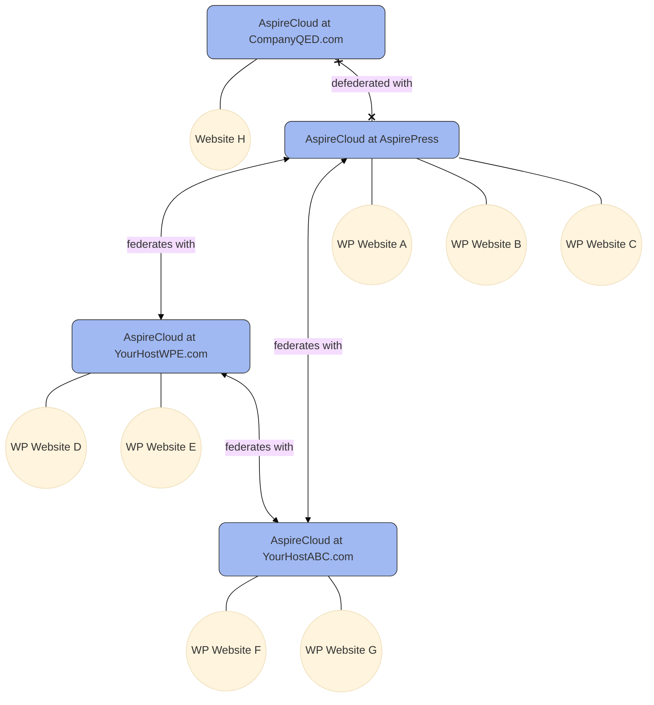

## What is AspireCloud?

[AspireCloud](https://github.com/aspirepress/AspireCloud) is an open source project that functions as a CDN and a set of API endpoints for distributing WordPress assets (themes, plugins, core) to users of the [AspirePress Update](/aspireupdate/) plugin.

The following is the architecture of AspireCloud federation/defederation model. In Phase 1, the federation concept is not yet supported.

## How to install AspireCloud

Download and install AspireCloud:

[In Development](https://github.com/aspirepress/AspireCloud/tree/main)

👥 The current team

| Slack                                        |     TZ     |                  Role |       Committment        |
| :------------------------------------------- | :--------: | --------------------: | :----------------------: |
| [@NamithJ ](https://github.com/sarah-savage) | (GMT-0500) |          Project Lead |           TBC            |
| [@chuckadams](https://github.com/chuckadams) | (GMT-0700) | AspireCloud Developer |     2 hours per week     |
| [@tmeister](https://github.com/tmeister)     | (GMT-0700) | AspireCloud Developer |           TBC            |
| [@asirota ](https://github.com/asirota)      | (GMT-0500) |         Documentation | 2 hours per week or more |

🚨Issues/Concerns

- A complete REST API for AspireCloud including federation/defederation
- An interopability specification with other repository projects
- Need a technical architect for working out the overall design
- Need testers!

📝 Upcoming topics

- Get feedback on proposed approach from AP community

✅ Action items

- Continue to document a technical architecture
- Divide labour and create projects and tasks and milestones

🔑 Key links

- Slack: See [#aspireupdate](https://app.slack.com/client/T07Q5LB7W23/C07Q88M2KQF) for discussion
- Slack: See [#aspirecloud](https://app.slack.com/client/T07Q5LB7W23/C07QYT2BRQ9) for discussion

### Configuration

See [AspireCloud](https://github.com/aspirepress/AspireCloud)

## Contributing

AspirePress welcomes contributions from people like you. We encourage you to review
our [Contribution Guidelines](https://github.com/aspirepress/.github/blob/main/CONTRIBUTING.md).

## Code of Conduct

AspirePress also implements a [Code of Conduct](https://github.com/aspirepress/.github/blob/main/CODE_OF_CONDUCT.md),
adherance to which is required by all members of the project.

## Credits

AspirePress is a community project, powered by people just like you. Thank you to
our [contributors](https://github.com/aspirepress/.github/blob/main/CREDITS.md) for their generous participation in
AspirePress.
