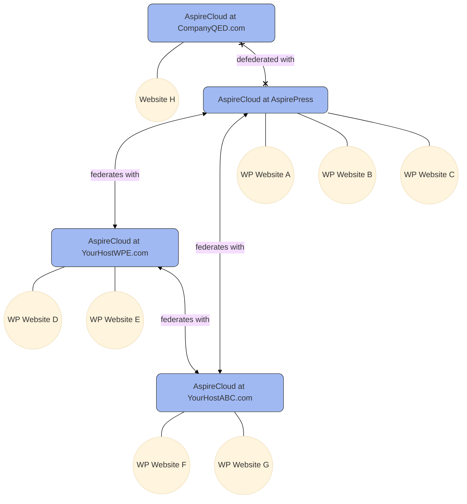

## What is AspireCloud?

[AspireCloud](https://github.com/aspirepress/AspireCloud) is an open source project that functions as a CDN and a set of API endpoints for distributing WordPress assets (themes, plugins, core) to users of the [AspirePress Update](/aspireupdate/) plugin.

The following is the architecture of AspireCloud federation/defederation model. In Phase 1, the federation concept is not yet supported.

## How to install AspireCloud

[Clone and Install AspireCloud](https://github.com/aspirepress/AspireCloud?tab=readme-ov-file#quick-start)

### Configuration

See [AspireCloud README](https://github.com/aspirepress/AspireCloud)

## 👥 The AspireCloud Contributors

[AspireCloud Contributors](https://github.com/aspirepress/AspireCloud/graphs/contributors)

## 🚨Issues/Concerns

- A complete REST API for AspireCloud including federation/defederation
- An interopability specification with other repository projects
- Need testers and implementers!

## ✅ Action items

- Continue to document a technical architecture

## 🔑 Key links

- Slack: See [#aspirecloud](https://app.slack.com/client/T07Q5LB7W23/C07QYT2BRQ9) for discussion

## Contributing

AspirePress welcomes contributions from people like you. We encourage you to review
our [Contribution Guidelines](https://github.com/aspirepress/.github/blob/main/CONTRIBUTING.md).

## Code of Conduct

AspirePress also implements a [Code of Conduct](https://github.com/aspirepress/.github/blob/main/CODE_OF_CONDUCT.md),
adherance to which is required by all members of the project.

## Credits

AspirePress is a community project, powered by people just like you. Thank you to
our [contributors](https://github.com/aspirepress/.github/blob/main/CREDITS.md) for their generous participation in
AspirePress.
