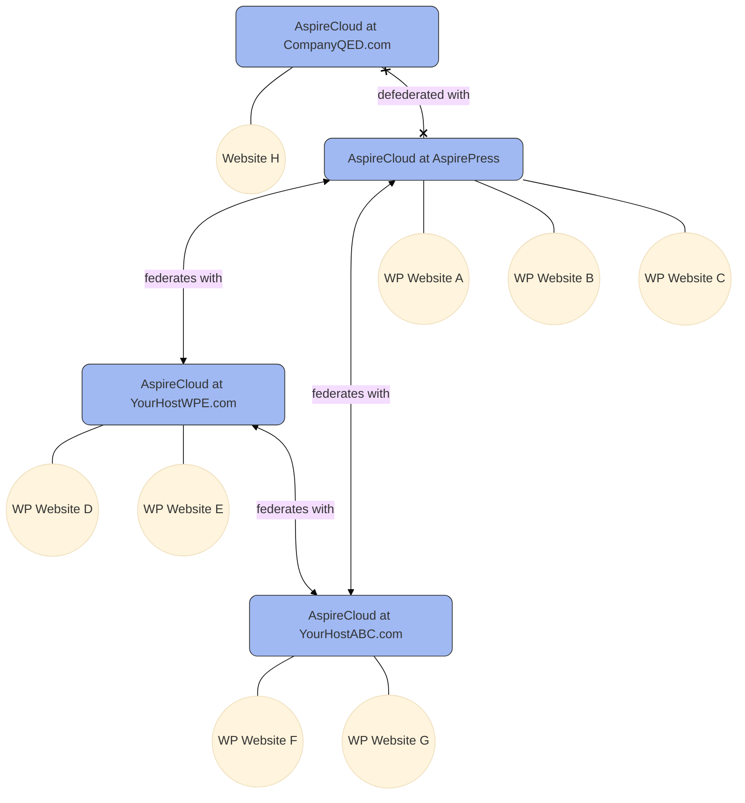

## What is AspireCloud?

[AspireCloud](https://github.com/aspirepress/AspireCloud) is an open source project that functions as a CDN and a set of API endpoints for distributing WordPress assets (themes, plugins, core) to users of the [AspirePress Update](/aspireupdate/) plugin.

The following is the architecture of AspireCloud federation/defederation model. In Phase 1, the federation concept is not yet supported.

## How to install AspireCloud
[Clone and Install AspireCloud](https://github.com/aspirepress/AspireCloud?tab=readme-ov-file#quick-start)

### Configuration
- A complete REST API for AspireCloud including federation/defederation
- An interoperability specification with other repository projects

