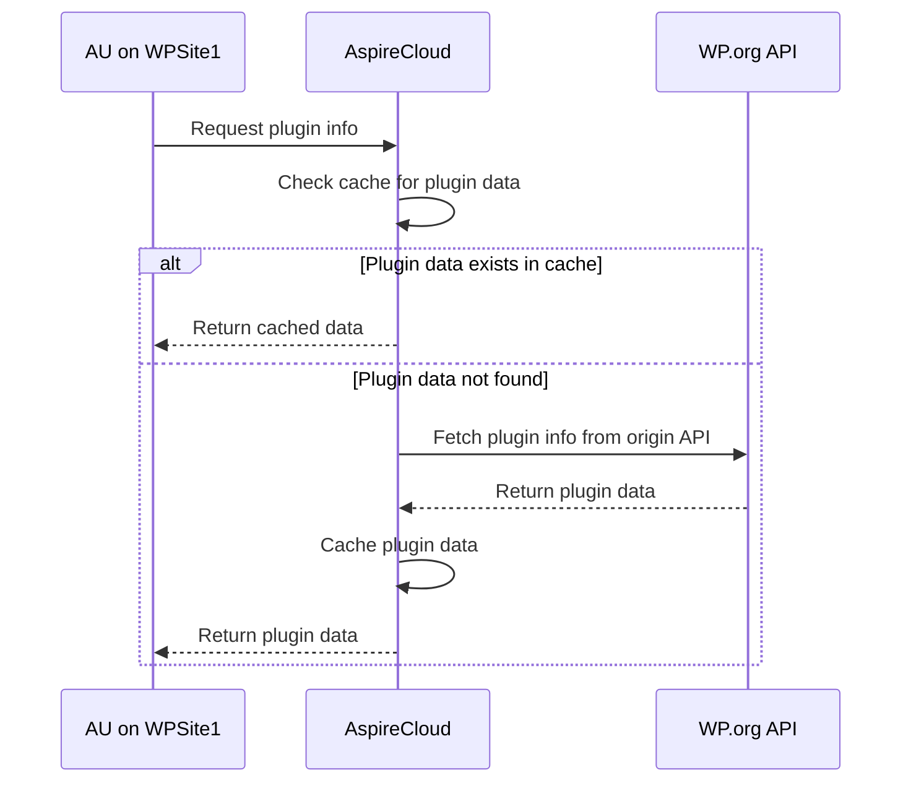

## What is AspireUpdate?

[AspireUpdate](https://github.com/aspirepress/AspireUdate) is an open source project that allows WordPress sites to use an alternative repository for updates. The plugin reverts to WordPress.org repository when updates are not available in the configured mirror.

Here are the current main features of AspireUpdate:

## How to load AspireSync

This is a standard WordPress Plugin

An Approach to the AspireCloud v1 implementation You can read this specification very much like Domain Name Service works (DNS). It has architecturally a very similar approach, except the architecture serves WordPress assets rather than domain lookups.

Overall Status: v0.1 doesn’t implement 4,5,7,8 yet. 
[Testing Link in WP Playgrounds](https://playground.wordpress.net/?blueprint-url=https://raw.githubusercontent.com/aspirepress/AspireUpdate/refs/heads/playground-ready/assets/playground/blueprint.json)

https://github.com/mzalewski/wpupdates/blob/master/includes/update-endpoints.php For endpoint mocker 

This approach has several benefits:

* Scopes down AspireSync entirely out of the solution for now. No federation between AspireClouds for now.
* Initial mirror(s) start with zero plugins or themes and grow organically as demand for hosting on mirror grows. 
* Installation is greatly reduced - need AspireUpdate plugin at the user's end and AspireCloud v1 service to handle update requests and delegate to .org if there is no asset to serve from configured API update endpoint. 
* Developers can ask for a plugin theme to be hosted at a mirror. 
* Hosting companies can set this up for their default WordPress installs with default AspireClouds on their own. Let a million mirrors bloom. 

1. Aspire Updater plugin is installed on a site. User can choose from a list of known AspireClouds. Or it can be locked to one by host. 
2. The plugin rewrites all API calls to api.aspirepress.org or to another AspireCloud powered API. AP maintains for now  a set of trusted API end points which correspond to AspireCloud mirrors. 
3. If AspireCloud has a response, that requested asset is available, we give the asset back to plugin.
4. If AspireCloud does not have the  asset, AspireUodate then calls .org canonical repo. It fetches the asset, pushes the whole response to AspireCloud to populate the mirror with the requested asset. This is how a specific AspireCloud gets populated with new assets beyond manual population by a plugin or theme developer.
5. AspireUpdate passes the response of asset back to WordPress for handling the update install process. 
6. AspireCloud receives the asset, stores it  in the data store. It can later serve requests for newly acquired asset. 
7. The asset that was pulled in from .org will expire after say 1 day (configurable).
8. Once the asset expires, future requests to  AspireCloud  tells AspireUpdate that it doesn’t have the asset, fetches it again in the similar approach as above. 
9. The Process repeats as requests are made for updates. Escalations to .org are made when an asset locally is not available. 

👥 The current team

@NamithJ (GMT+0530) - AspireUpdate dev - 4 hours
@Alex (NewPath) (GMT -0500) AspireUpdate Lead - 1 hour per day maybe more on weekends if I absolutely have to ;)
@Beda Schmid (GMT +0800) - AspireUpdate 2 hours per day 
@Luc Princen (GMT+0200) - AspireCloud - 1 hr per day
@Yosef Eliezrie  Project Management

🚨Issues/Concerns

* Need Another plugin dev or two
* A rest API dev to develop the headless WP or the necessary API service
* Need a architect for working out the overall design 
* Need testers
* Is there support for theme updates in v1?

📝 Upcoming topics

* Get feedback on proposed approach from AP community

✅ Action items

* Assemble team of Committers
* Document a technical architecture 
* Divide labour and create projects and  tasks and milestones @Yosef Eliezrie 

🔑 Key links

* see  #aspireupdate  for plugin state
* See #aspirecloud  for API state

### Configuration

### Usage of AspireSync

 | Command                 | Arguments                          | Options                                        | Description                                                                                           |
 | ----------------------- | ---------------------------------- | ---------------------------------------------- | ----------------------------------------------------------------------------------------------------- |
 | `meta:download:plugins` | None                               | [--update-all or -u] [--plugins]               | Downloads metadata for plugins.                                                                       |
 | `meta:download:themes`  | None                               | [--update-all or -u] [--themes]                | Downloads metadata for themes.                                                                        |
 | `meta:import:plugins`   | None                               | [--update-list]                                | Imports the downloaded metadata for plugins. Assumes you've run `meta:download:plugins`               |
 | `meta:import:themes`    | None                               | [--update-list]                                | Imports the downloaded metadata for themes. Assumes you've run `meta:download:themes`                 |
 | `download:plugins`      | [num-to-pull=latest]               | [--plugins [--force-download or -f]            | Downloads any plugins outstanding from the last time the command was run. Defaults to latest version, |
 | `download:themes`       | [num-to-pull=latest]               | [--themes] [--force-download or  -f]           | Downloads any themes outstanding from the last time the command was run. Defaults to latest version.  |
 | `util:upload`           | action<plugins, themes>            | [--slugs] [--limit] [--offset] [--clean or -c] | Uploads any downloaded plugins/themes to your file system (right now supports S3).                    |
 | `util:clean`            | None                               | None                                           | Cleans the data directory of any files that remain.                                                   |
 | `run:all`               | [asset-type<all, plugins, themes>] | None                                           | Runs the four commands for themes/plugins or both. A shortcut to a full run of the downloader.        |

## Contributing

AspirePress welcomes contributions from people like you. We encourage you to review
our [Contribution Guidelines](https://github.com/aspirepress/.github/blob/main/CONTRIBUTING.md).

## Code of Conduct

AspirePress also implements a [Code of Conduct](https://github.com/aspirepress/.github/blob/main/CODE_OF_CONDUCT.md),
adherance to which is required by all members of the project.

## Credits

AspirePress is a community project, powered by people just like you. Thank you to
our [contributors](https://github.com/aspirepress/.github/blob/main/CREDITS.md) for their generous participation in
AspirePress.

