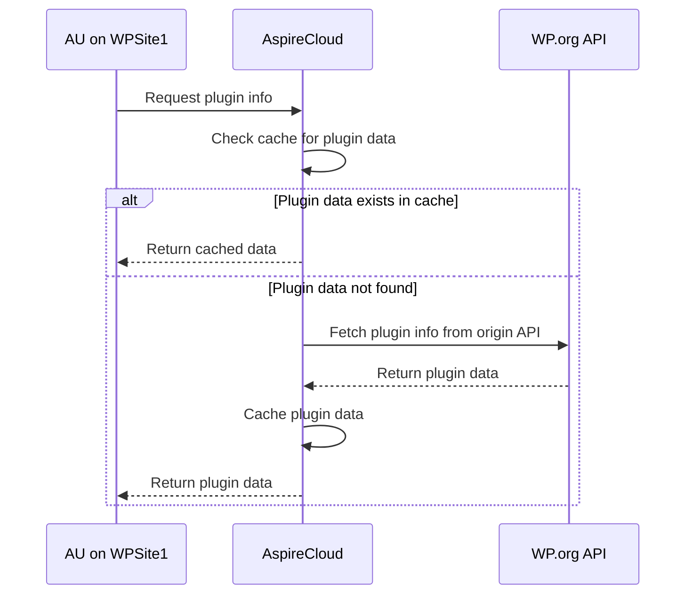

## What is AspireUpdate?

[AspireUpdate](https://github.com/aspirepress/AspireUpdate) is an open source project that enables WordPress sites to use an alternative repository for updates. The plugin reverts to WordPress.org repository when updates are not available in the configured mirror.

## How to install AspireUpdate

Download and install AspireUpdate:
[Development](https://github.com/aspirepress/AspireUpdate/tree/Develop)
[Main](https://github.com/aspirepress/AspireUpdate/tree/main)

WP Playground: [Testing Link in WP Playground](https://playground.wordpress.net/?blueprint-url=https://raw.githubusercontent.com/aspirepress/AspireUpdate/refs/heads/playground-ready/assets/playground/blueprint.json) [WP Playground Blueprint](https://github.com/aspirepress/AspireUpdate/blob/playground-ready/assets/playground/blueprint.json)

## Design of Phase 1 of AspirePress

You can read this specification very much like Domain Name Service works (DNS). It has architecturally a very similar approach, except the architecture serves WordPress assets rather than domain lookups.

Overall Status: v0.1 doesn’t implement all of this design yet.

State Diagram:

[Diagram by Mermaid](https://github.blog/developer-skills/github/include-diagrams-markdown-files-mermaid/)

This approach has several benefits:

1. test
2. test
   
3. Scopes down AspireSync entirely out of the solution for now. No federation between AspireClouds for now. Initial mirror(s) start with zero plugins or themes and grow organically as demand for hosting on mirror grows. Installation is greatly reduced as you need AspireUpdate plugin at the user's end and AspireCloud service to handle update requests and delegate to .org if there is no asset to serve from configured API update endpoint. 
   
4. Hosting companies can set this up for their default WordPress installs with default AspireClouds on their own. Let a million mirrors bloom!
   
5. Aspire Updater plugin is installed on a site. User can choose from a list of known AspireClouds, or it can be locked to one by host. 
   
6. The plugin rewrites all API calls to api.aspirepress.org or to another AspireCloud powered API. AP maintains for now  a set of trusted API end points which correspond to AspireCloud mirrors. 
   
7. If AspireCloud has a response, that requested asset is available, we give the asset back to plugin.
   
8. If AspireCloud does not have the  asset, AspireUodate then calls .org canonical repo. It fetches the asset, pushes the whole response to AspireCloud to populate the mirror with the requested asset. This is how a specific AspireCloud gets populated with new assets beyond manual population by a plugin or theme developer.
   
9.  AspireUpdate passes the response of asset back to WordPress for handling the update install process. 
   
10. AspireCloud receives the asset, stores it  in the data store. It can later serve requests for newly acquired asset. 

11. The asset that was pulled in from .org will expire after say 1 day (configurable).
   
12. Once the asset expires, future requests to  AspireCloud  tells AspireUpdate that it doesn’t have the asset, fetches it again in the similar approach as above. 

13. The Process repeats as requests are made for updates. Deletgations are made to WordPress.org are made when an asset locally is not available. 

👥 The current team

| Slack        |     TZ      |                   Role |        Committment        |
| :----------- | :---------: | ---------------------: | :-----------------------: |
| @NamithJ     | (GMT+0530)  | AspireUpdate Developer |       4 hours/week        |
| @Alex        | (GMT -0500) |      AspireUpdate Lead | 1 hour per day maybe more |
| @Beda Schmid | (GMT +0800) | AspireUpdate Developer |   2 hours per day more    |
| @Luc Princen | (GMT+0200)  |  AspireCloud Developer |       1 hr per day        |

🚨Issues/Concerns

* Need Another plugin dev/tester
* A REST API dev to develop the AspireCloud
* Need a technical architect for working out the overall design 
* Need testers!
* Is there support for theme updates in v1?

📝 Upcoming topics

* Get feedback on proposed approach from AP community

✅ Action items

* Continue to document a technical architecture 
* Divide labour and create projects and  tasks and milestones @Yosef Eliezrie 

🔑 Key links

* Slack: See [#aspireupdate](https://app.slack.com/client/T07Q5LB7W23/C07Q88M2KQF) for discussion
* Slack: See [#aspirecloud]([index.md](https://app.slack.com/client/T07Q5LB7W23/C07QYT2BRQ9))  for discission

### Configuration

By default the plugin is accessing the api.aspirecloud.org endpoint. There should be no other configuration required. You can turn on the debug log and reset the settings. Use the advanced=true query param in the settings screen to turn on advanced configuration settings.

## Contributing

AspirePress welcomes contributions from people like you. We encourage you to review
our [Contribution Guidelines](https://github.com/aspirepress/.github/blob/main/CONTRIBUTING.md).

## Code of Conduct

AspirePress also implements a [Code of Conduct](https://github.com/aspirepress/.github/blob/main/CODE_OF_CONDUCT.md),
adherance to which is required by all members of the project.

## Credits

AspirePress is a community project, powered by people just like you. Thank you to
our [contributors](https://github.com/aspirepress/.github/blob/main/CREDITS.md) for their generous participation in
AspirePress.

